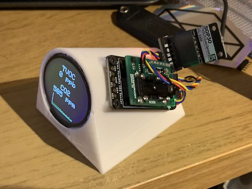

# ESP32-CO2
CO2 + TVOC + Humidity monitor using the ESP32

## BOM
  - 1x ESP32 (Adafruit Feather HUZZAH32)
  - 1x Round 1.28" LCD Display Module (Waveshare)
  - 1x SCD-30 (Adafruit)
  - 1x SGP30 (pimoroni)
  - Some white PLA+
  - Some screws
  - Wires & Cables
  - A Qwiic to Breakout Garden converter
  - A Qwiic to dupoint converter

## Building Notes
  - Print the 3D models, printer settings don't really matter
  - Attach the ESP32 to the base plate using screws
  - Need to shorten the wires for the display, can seperate them out into 3x 3pin dupoint connnectors for SPI, 3v+gap+Ground, the backlight+reset+dc(?) pin as well
  - Can plug the Qwiic to dupoint converter in & pass it through the big hole in the case
  - Close the case, connect the display cables to the board using tweezers through the hole
  - Connect the SCD30 to the Qwiic line from the board
  - Connect the SGP30 using a Qwiic line from the SCD30
  - Screw down the sensors
  - Follow the Homespan guide for setting up WiFi & pairing (everything was just left as default)

## Notes
  - Uses [Homespan](https://github.com/HomeSpan/HomeSpan) so it really connects to HomeKit instead of via Homebridge
  - I wanted to also store a CSV of the readings within the ESP32's filesystem but I'd probably never read it.
  - For some reason the temperature readings are considerably off for the first minute or so of plugging the device in
